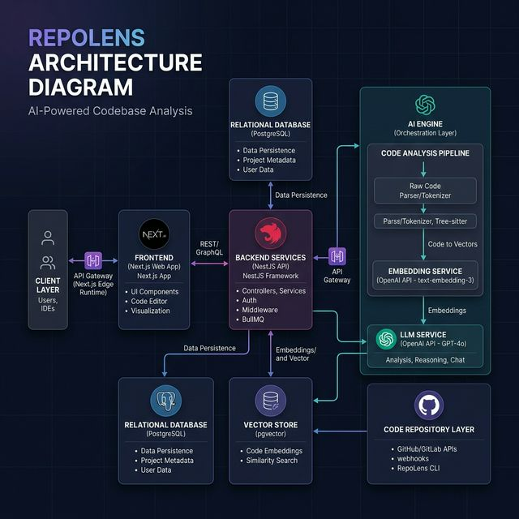
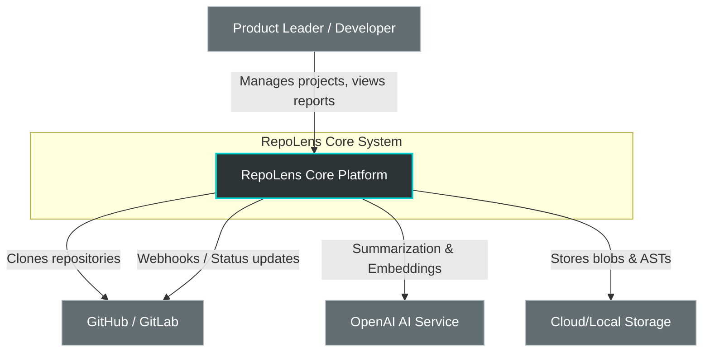
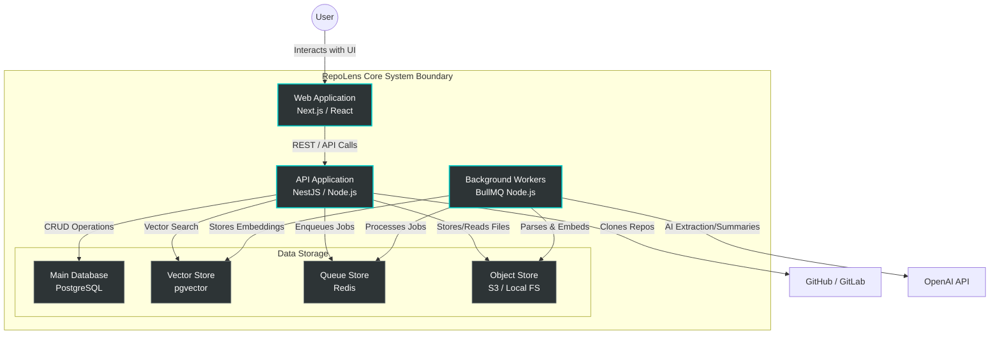
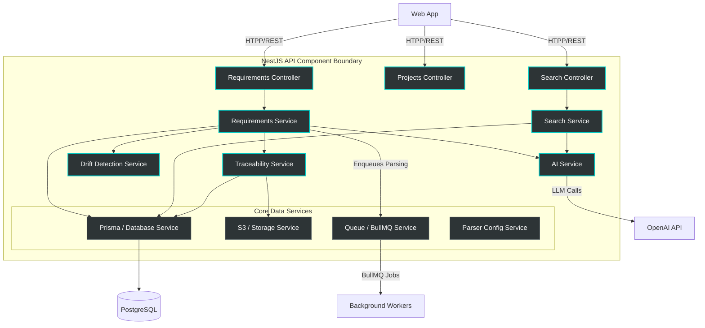
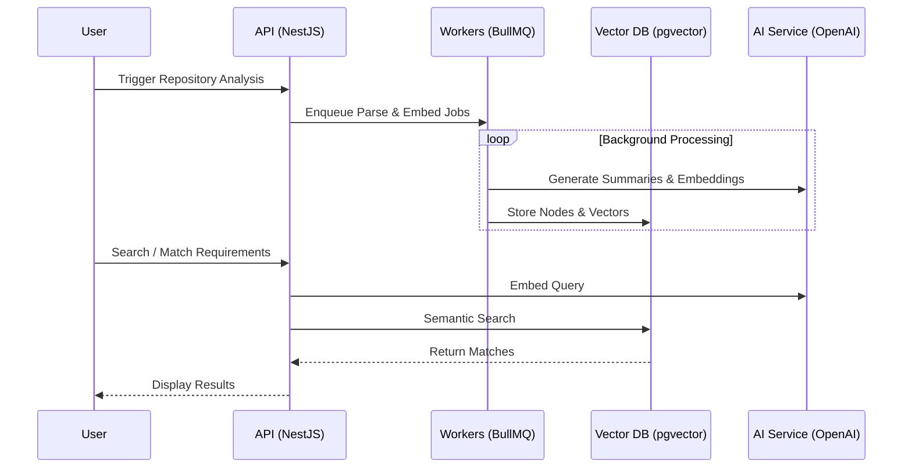

# RepoLens Core: Codebase Overview

RepoLens Core is an AI-powered requirements engineering and codebase analysis platform.

## 🏗️ System Architecture

### System Context Diagram (Level 1)

### System Container Diagram (Level 2)

### API Component Diagram (Level 3)

## 🔄 Core Workflow (Sequence)

## 🧩 Components and Responsibilities

| Component | Primary Responsibilities | Key Interactions |
| :--- | :--- | :--- |
| **Repository Analysis Engine** | Handles cloning, file discovery, and content deduplication (SHA256). | Provides cleaned source files to the Parsing & Structural Analysis component. |
| **Parsing & Structural Analysis** | Converts files to ASTs (Tree-sitter) and extracts code nodes, symbols, and references. | Supplies structured nodes and dependency graphs to the Semantic Indexing component. |
| **Semantic Indexing** | Generates AI summaries and vector embeddings; manages search indices in PostgreSQL. | Supports the AI Reasoning and Traceability components through semantic retrieval. |
| **AI Reasoning Component** | Handles requirement extraction (LLM), code summarization, and RAG-based analysis. | Consumes semantically retrieved code context and structured requirement data. |
| **Traceability & Drift Detection** | Maintains requirement-to-code links; monitors evolution to detect implementation drift. | Utilizes embeddings and symbol metadata to validate alignment between docs and code. |

## 📂 Project Structure

- `api/`: NestJS backend (Requirements, Search, Workers).
- `frontend/`: Next.js UI.
- `prisma/`: Database schema (PostgreSQL + pgvector).

## 🛠️ Tech Stack

- **Backend**: NestJS, Prisma, BullMQ.
- **Frontend**: Next.js, Tailwind CSS.
- **AI**: OpenAI GPT-4o & Text Embeddings.
- **Database**: PostgreSQL + pgvector.
